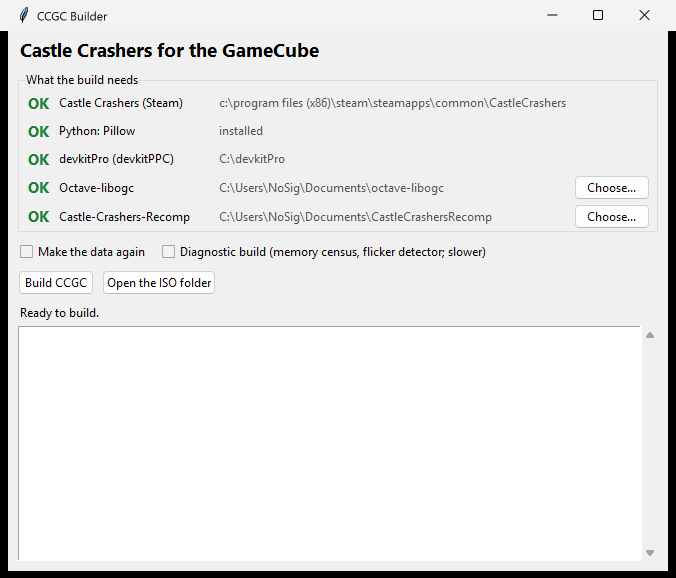

# Castle Crashers GC

Castle Crashers ([Castle-Crashers-Recomp](https://github.com/myuu-151/Castle-Crashers-Recomp),
the native reimplementation) on the Nintendo GameCube, built on the
[Octave](https://github.com/myuu-151/Octave-libogc) engine.

## What you need

- **Castle Crashers, from Steam.** The game's data is made only from your own
  copy; none of it is in this repository. Installed through Steam, it's found
  by itself; downloaded another way (a depot download, which Steam doesn't
  list), choose its folder, the one with `castle.exe` and `data/`.
- **[devkitPro](https://devkitpro.org/)** with devkitPPC and libogc.
- **[Octave-libogc](https://github.com/myuu-151/Octave-libogc)** v2.2 or later,
  with its GameCube engine library (`Engine/Build/GCN/libEngine.a`) and
  `Octave.exe` (both come built in its release).
- **[Castle-Crashers-Recomp](https://github.com/myuu-151/Castle-Crashers-Recomp)**:
  the engine's source, which the GameCube build compiles.
- **Python 3** with [Pillow](https://python-pillow.org/).

By default they're found next to this repository:

```
Documents/
  CCGC/                    this repository
  octave-libogc/           Octave-libogc
  CastleCrashersRecomp/    Castle-Crashers-Recomp
```

## Building

### The easy way

Double-click **`Build CCGC.bat`**. The builder window:

- checks each thing above and says how to fix anything missing, and lets you
  choose where the game, Octave-libogc and Castle-Crashers-Recomp are;
- builds everything with one button, **Build CCGC**, in the background (no
  console windows), showing each step and how far it is;
- keeps its log short (the steps and any errors): tick **Show every line**
  for the rest, which is also in `build/builder.log`;
- opens the folder with your ISO when it's done.

Tick **Make the data again** after the data tools change. **Diagnostic build**
adds the memory census and the flicker detector (see
[docs/hardware-testing.md](docs/hardware-testing.md)); it plays slower.
**SD card log** writes what the game does to `ppgc.log` on the SD card, for
reporting a problem; without it (and without Diagnostic build, which has it
too) the game writes nothing to the card.



### By hand

**1. Make the data** from your copy of the game:

```
python tools/make_data.py [--game <the game's folder>]
```

- **Finding the game:** the folder given (`--game`, or `CC_GAME` in the
  environment), else through Steam's own records (Steam app 204360). Either
  way it checks that some of its files are the Steam copy's; if not, it stops
  and says why.
- **What it does:** decrypts the game's `.pak` archives, unwraps the SWFs and
  normalizes their scripts (`tools/extract/`), reads the text from
  `castle.exe`, and takes the collision, fonts, sound and music as they are,
  into `build/game/assets/`. Then `tools/copy_data.py` puts it all into
  `CCGC/Scripts/Data/` (which git ignores): the sound converted to Microsoft
  ADPCM with the ffmpeg that comes with Octave-libogc, `files.txt`, and the
  disc and memory card art.

**2. Build the disc** from the `octave-libogc` folder:

```
Octave.exe -headless -project <path to this repo>/CCGC/CCGC.octp -build GameCube
```

This compiles the game with `CCGC/Makefile_GCN` and packs it with the data.
The result is `CCGC/Packaged/GameCube/CCGC.iso`, about 185 MB. It plays in
Dolphin, and on a GameCube through Swiss. The build compiles libtess2 and stb
from Castle-Crashers-Recomp's `build/_deps/` (there once it's configured for
the PC); the builder fetches them into `build/deps/` if they aren't, and
`DEPS=<folder>` points the build at them.

`make -f Makefile_GCN` in `CCGC/` compiles just the DOL.

### Testing switches

For reaching a level quickly in Dolphin (never on a disc for playing): a file
in `CCGC/Scripts/Data/` with a number in it.

- `level.txt`: the first level the game loads is that one instead (20 is Tall
  Grass Field).
- `max.txt`: that character maxed in the save, level 99 with every stat 25
  (1 the green knight, 2 the red, 3 the blue, 4 the orange).

## Layout

| Path | Contents |
|---|---|
| `CCGC/Source/` | The GameCube side: `CastleGame` (30 ticks a second, pads, the slot A check), `StageWidget` (draws the stage in Octave's UI pass), `renderer_gx.cpp`, `files_gc.cpp`, `MemoryCard.cpp` |
| `CCGC/Makefile_GCN` | Compiles the engine's sources from `../CastleCrashersRecomp/engine` with these |
| `art/` | The disc banner and the memory card banner (96 x 32), the memory card icon (32 x 32), and this page's banner |
| `tools/make_data.py` | Makes the data from your Steam copy of the game (`tools/extract/`), then runs `copy_data.py` |
| `tools/copy_data.py` | Copies an `assets/` folder (SWFs, fonts, strings, collision, sound) into `CCGC/Scripts/Data`, and runs `make_art.py` |
| `tools/builder.py` | The builder window (`Build CCGC.bat`) |
| `docs/triage.md` | A bug on the console: the engine's (check the PC first), the port's, or Octave's / the hardware's, and each one's pipeline |
| `docs/hardware-testing.md` | Testing on the console: what the game logs to the SD card, line by line, the flicker detector and filmstrip, naming code addresses |
| `docs/hardware-bugs.md` | Bugs that showed only on the console, how each was found, and the fix |
| `docs/gamecube-code.md` | Before writing low-level GameCube code here: where Octave already does it, to follow |

## Status

Boots, plays through the menus and character select into the first stage at
30 ticks a second, with sound (music streamed from the disc, effects from
ARAM) and masks (on the depth buffer: the GameCube has no stencil buffer),
and saves to the memory card in slot A (checked at boot; the title menu's
Save / Load page). Not done yet:

- The later stages, tested; memory is tight
- Checking that it plays 1:1 with the PC version (replaying a recording on the
  console)
